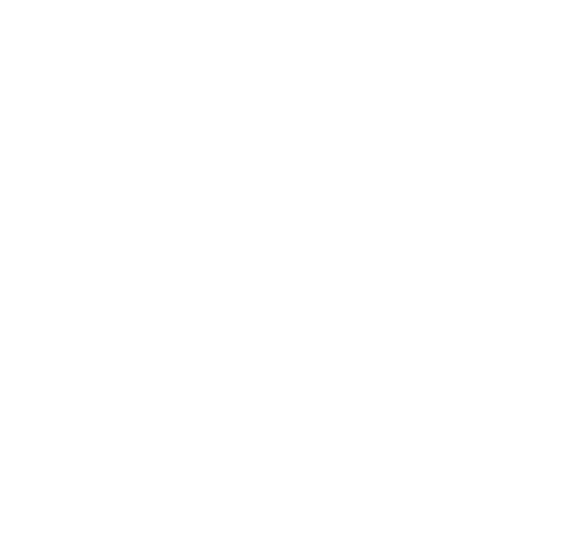
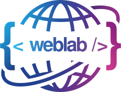

   
  
  
   
  
  # SKY LAB
  **Yıldız Technical University Computer Science Club**

  

   
   

  

    
    
    
    
  

  ---

  

    <i>The official SKY LAB website — presenting the club’s identity, teams, and projects with a modern, fast, and mobile-friendly experience.</i>
  

   

  

    <kbd>Developed by</kbd>  
     
    
  

