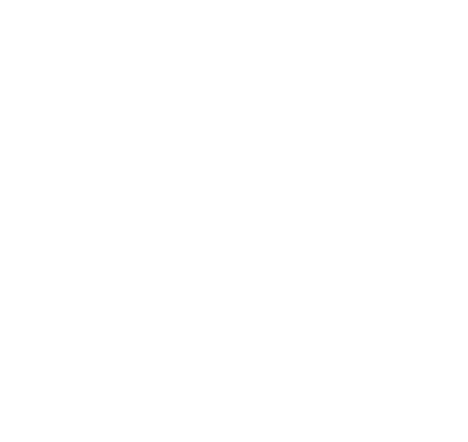
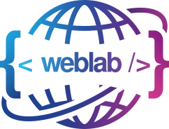

<div align="center">
  <br />
  
  
  <br />
  
  # SKY LAB
  **Yıldız Technical University Computer Science Club**

  <a href="https://yildizskylab.com" target="_blank">
    
  </a>

  <br />
  <br />

  <p>
    
    
    
    
  </p>

  ---

  <p align="center" style="max-width: 600px;">
    <i>The official SKY LAB website — presenting the club’s identity, teams, and projects with a modern, fast, and mobile-friendly experience.</i>
  </p>

  <br />

  <p align="center">
    <kbd>Developed by</kbd> <br />
    <br />
    
  </p>
</div>

## Local development

```bash
npm install
npm run dev   # http://localhost:3000
```

Local development runs against the **sandbox**, never the production API or realm. `.env.local`:

```env
# The CMS through `npm run dev`'s proxy to the sandbox API (next.config.ts, `next dev` only):
# the editor in the browser only talks to localhost, since the edge does not let
# http://localhost:3000 call the club's hosts cross-origin. Change the port with the dev server's.
CMS_URL=http://localhost:3000/sandbox-api/api
# Core, for the CMS image bridge (server to server)
API_BASE_URL=https://sandbox-api.yildizskylab.com
KEYCLOAK_ISSUER=https://e.yildizskylab.com/realms/e-skylab-sandbox
KEYCLOAK_CLIENT_ID=frontend-main
KEYCLOAK_CLIENT_SECRET=
NEXTAUTH_URL=http://localhost:3000
# openssl rand -base64 32
NEXTAUTH_SECRET=
```

Without `CMS_URL` the server reads the sandbox CMS directly, which is enough for the public pages. The sandbox `frontend-main` client does not accept a localhost redirect URI, so the editor is tried on https://sandbox.yildizskylab.com. The deployed values come from the image build (`.github/workflows/ghcr.yml`) and Dokploy.

## Door check-in (`/kapi/[sessionId]`)

A guest without an account checks in to an event Session at the door. The door screen shows a QR that core signs and replaces every 15 seconds; it opens `/kapi/<sessionId>?dq=<token>`. The page asks for the e-mail of the guest's registration and posts `{email, doorToken}` from the browser to core's `POST /v1/sessions/{sessionId}/check-in/guest` (contract: core-backend `docs/guest-self-check-in.md`).

- Core's origin is `API_BASE_URL` from the image build (`CORE_API_ORIGIN`, next.config.ts); `npm run dev` sends the check-in through the `/sandbox-api` proxy instead.
- The call goes from the browser, not through this site's server, because core limits failed attempts per client address: through a server every guest would share one address. The edge's CORS (`cors-pub`) allows `https://yildizskylab.com` and `https://sandbox.yildizskylab.com`.
- The page is `noindex`, sends no Referer, keeps the e-mail only in memory and takes `dq` out of the address bar after it loads.
- Core builds the QR's address from `DOOR_QR_GUEST_URL` (core's environment): `https://yildizskylab.com/kapi/{sessionId}` in production, `https://sandbox.yildizskylab.com/kapi/{sessionId}` in the sandbox.
